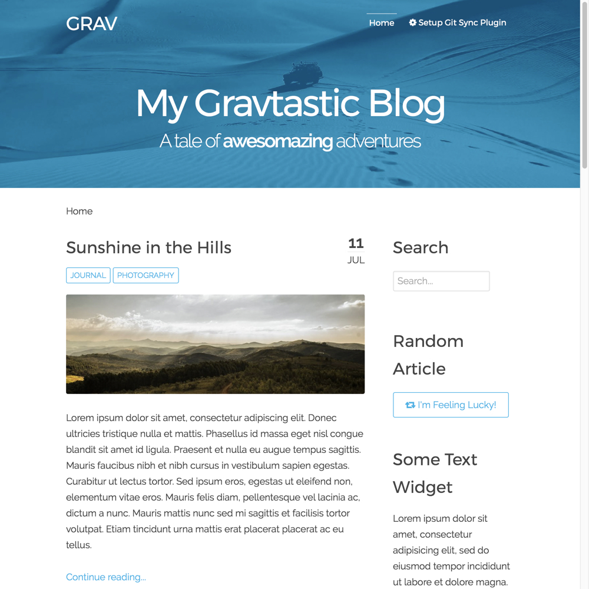

# Antimatter with Git Sync



Antimatter with Git Sync is is a customized version of the default [Grav](http://getgrav.org) theme. Simple, fast and modern.

## Manual Installation

To install this theme, just download the zip version of this repository and unzip it under `/your/site/grav/user/themes`. Then, rename the folder to `antimatter-git-sync`.

You should now have all the theme files under

    /your/site/grav/user/themes/antimatter-git-sync

## Manual Update

Manually updating Antimatter with Git Sync is pretty simple. Here is what you will need to do to get this done:

* Delete the `your/site/user/themes/antimatter-git-sync` directory.
* Download the new version of the Antimatter with Git Sync theme.
* Unzip the zip file in `your/site/user/themes` and rename the resulting folder to `antimatter-git-sync`.
* Clear the Grav cache. The simplest way to do this is by going to the root Grav directory in terminal and typing `bin/grav clear-cache`.

> Note: Any changes you have made to any of the files listed under this directory will also be removed and replaced by the new set. Any files located elsewhere (for example a YAML settings file placed in `user/config/themes`) will remain intact.

## Features

* Lightweight and minimal for optimal performance
* Fully responsive with off-page mobile navigation
* SCSS based CSS source files for easy customization
* Built-in support for on-page navigation
* Multiple page template types
* Fontawesome icon support

### Supported Page Templates

* Default view template
* Blog view template
* Error view template
* Blog item view template
* Modular view templates:
  * Features Modular view template
  * Showcase Modular view template
  * Text Modular view template
* SnipCart view template

### Menu Features

##### Dropdown Menu

You can enable **dropdown menu** support by enabling it in the `antimatter-git-sync.yaml` configuration file. As per usual, copy this file to your `user/config/themes/` folder (create if required) and edit there.

```
dropdown:
  enabled: true
```

This will ensure that sub-pages show up as sub-menus in the navigation.

##### Menu Text & Icons

Each page shows up in the menu using the title by default, however you can set what displays in the menu directly by setting an explicit `menu:` option in the page header:

```
menu: My Menu
```

You can also provide an icon to show up in front of the menu item by providing an `icon:` option.  You need to use name of the FontAwesome icon without the `fa-` prefix.  Check out the full [list of current FontAwesome 4.2 icons](http://fortawesome.github.io/Font-Awesome/icons/):

```
icon: bar-chart-o
```

#### Custom Menu Items

By default, Grav generates the menu from the page structure.  However, there are times when you may want to add custom menu items to the end of the menu.  This is now supported in Antimatter by creating a menu list in your `site.yaml` file.  An example of this is as follows:

```
menu:
    - text: Source
      url: https://github.com/getgrav/grav
    - icon: twitter
      url: http://twitter.com/getgrav
```

The `url:` option is required, but you can provide **either** or **both** `text:` and/or `icon:`

### Blog Features

##### Daring Fireball Link Pages

Antimatter with Git Sync supports the ability for a page to have a `link:` header option.  This will then in turn create a **link page** where the title of the page will actually be linked to the link provided and a prefexid double angle `>>` will link to the page itself.  Simply provide the link in the page header:

```
link: http://getgrav.org/blog
```

# Setup

🚨Before setting up Git Sync, please make sure to remove the `ReadMe.md` file in your Grav site `user` folder (if one exists). This will prevent a possible sync issue when creating a default `ReadMe.md` file in your new Git repository.🚨

If you want to set Antimatter with Git Sync as the default theme, you can do so by following these steps:

* Navigate to `/your/site/grav/user/config`.
* Open the **system.yaml** file.
* Change the `theme:` setting to `theme: antimatter-git-sync`.
* Save your changes.
* Clear the Grav cache. The simplest way to do this is by going to the root Grav directory in Terminal and typing `bin/grav clear-cache`.

Once this is done, you should be able to see the new theme on the frontend. Keep in mind any customizations made to the previous theme will not be reflected as all of the theme and templating information is now being pulled from the **antimatter git sync** folder.
